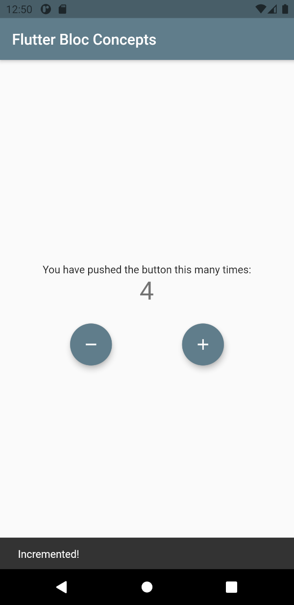
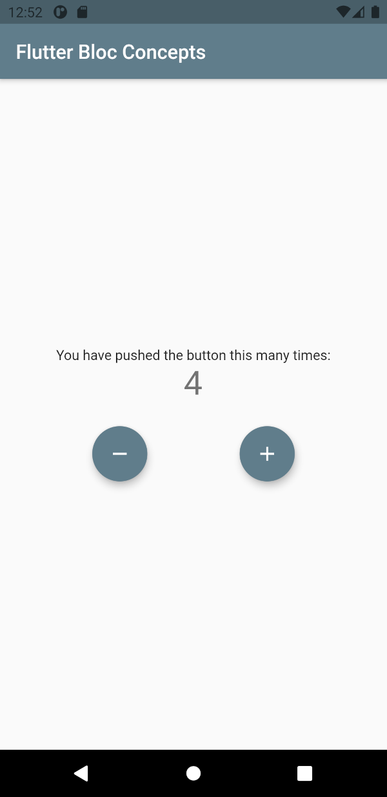

# flutter_bloc_concepts

There are a couple of concepts and constructs that are provided by Flutter BLoC package:

1. BlocProvider
   - It helps getting the access to a Bloc or Cubit using `BlocProvider.of<MyBloc>(context)`.
   - In different screens, `BlocProvider.value<MyBlock>()` TBD
2. BlocBuilder
   - It helps rebuilding the UI based on bloc state changes.
3. BlocListener
   - It can listen to state changes and react to it.
4. BlocConsumer
   - It combines both BlocBuilder and BlocListener into one widget.
5. MultiBlocListener, MultiBlocProvider, MultiRepositoryProvider

## How it looks?

Just like that as you can see below. It is based on the standard Counter sample that gets created by default with a new Flutter project,
and it's using `BlocProvider` and `BlocConsumer` concepts to manage the state.

The state contains the counter value and a flag telling whether it was incremented or not. Based on this, when the value is incremented, a snackbar notification message is displayed for a short amount of time.

| screen with notification              | regular screen                  |
| ------------------------------------- | ------------------------------- |
|  |  |
