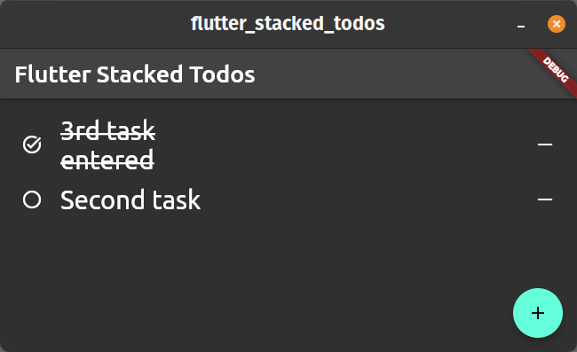

# flutter_stacked_todos

A classic todos sample done in Flutter using Stacked architecture.\
Being a simple example, it doesn't showcase additional packages like `stacked_services`, `stacked_cli` and so on, things that can be found [here](https://pub.dev/publishers/filledstacks.com/packages).

