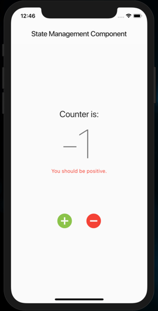

# state_mgmt_comp

I call it State Management Component (SMC), a simplified and elegant version of the BLoC pattern.

## Key Topics

_to be described_

## How it looks

We have one single screen (`MyHomePage`) that displays a counter whose value can be changed using the buttons, and an error message is displayed below the counter.

| positive scenario | negative scenario |
| --- | --- |
|  |  |

#### Two `StateBuilder`s version

Initially, two distinct `StateBuilder`s were used, one for each stateless widget that needs to be reactive.

In this case, the two widgets can use the `StateBuilder` (wrapping the `Column`) and the code is drastically simplified:

### Credits

This sample is my tryout of [MELLATI Meftah](https://medium.com/flutter-community/flutter-state-management-has-never-been-easier-think-statelessly-then-add-reactivity-d30c75760da0)'s approach to a simpler BLoC design.

