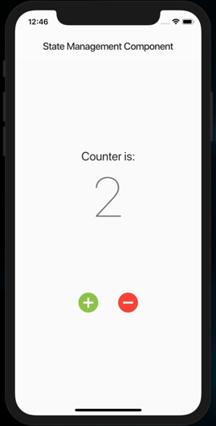
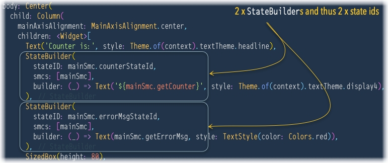
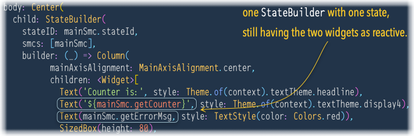

# state_model__sample1

This sample ilustrates a simplified and elegant version of the BLoC pattern. I call it `StateModel`.

## Key Concepts

Here are the key concepts used by this simplified design of BLoC-like pattern:

- `StateModel`
    - This is responsible with storing and managing (change, exposure, update notifications) a state
    - Each custom (app specific) state must extend this class.
    - Example: in this sample, see `MainState`.
- `StateBuilder`
    - It sets up the state dependencies (the states that are used, declared in `usingStates` parameter)
    - And builds the `Widget` that contains one or multiple stateless widgets that are using the declared states.
    - Example: in this sample, see the `build(context)` method of `MyHomePage`.

## How it looks

We have one single screen (`MyHomePage`) that displays a counter whose value can be changed using the buttons, and an error message is displayed below the counter.

| positive scenario | negative scenario |
| --- | --- |
|  |  |

#### Two `StateBuilder`s version

Initially, two distinct `StateBuilder`s were used, one for each stateless widget that needs to be reactive.

In this case, the two widgets can use the `StateBuilder` (wrapping the `Column`) and the code is drastically simplified:

### Credits

This sample is my tryout of [MELLATI Meftah](https://medium.com/flutter-community/flutter-state-management-has-never-been-easier-think-statelessly-then-add-reactivity-d30c75760da0)'s approach of a simplified BLoC design.

